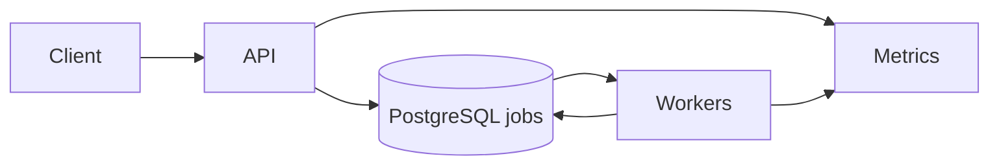

# GoFlow — End-to-End Brief

A short reference for the distributed job processing system before and during implementation.

---

## 1. What GoFlow Is

GoFlow is a mini backend system that processes tasks asynchronously: users submit jobs via API (e.g. generate report, process image, send email, simulate heavy task). The system stores jobs in a queue (PostgreSQL), a worker pool processes them concurrently with goroutines, retries failed jobs with exponential backoff, tracks status, and exposes metrics. Think: how real companies process emails, payments, reports, or analytics jobs—concurrency, APIs, reliability, queues, and system design in one repo.

---

## 2. Architecture



- **Client** → **API server** (HTTP) → **PostgreSQL** (single `jobs` table as the queue) → **Worker pool** (goroutines) → same DB for updates.
- **Metrics**: in-memory (or DB aggregates) exposed at `GET /metrics`.

---

## 3. Data Flow

- **Submit**: `POST /jobs` → insert row with `status = 'pending'`.
- **Workers**: in a loop, run a transaction: `SELECT ... FOR UPDATE SKIP LOCKED` to claim one row, set `status = 'processing'`, `started_at = now()`, process by `type`, then update `status` (`completed` or `failed`), `result` / `last_error`, `completed_at`.
- **Retry**: on failure, if `retries < max_retries` → set `scheduled_at = now() + backoff`, `status = 'pending'`, increment `retries`, store `last_error`; else set `status = 'failed'`.

---

## 4. Schema Summary

Single table **`jobs`** (see `migrations/001_create_jobs.up.sql` for the enforced schema):

| Column         | Type        | Purpose                                      |
|----------------|-------------|----------------------------------------------|
| id             | UUID, PK    | Unique job identifier                        |
| status         | VARCHAR(20) | pending, processing, completed, failed       |
| type           | VARCHAR(50) | report, image, email, heavy_task             |
| payload        | JSONB       | Task input                                   |
| result         | JSONB       | Output or error summary                      |
| retries        | INT         | Current attempt count                        |
| max_retries    | INT         | Default 3                                    |
| scheduled_at   | TIMESTAMPTZ | When job becomes eligible (used for backoff) |
| started_at     | TIMESTAMPTZ | When a worker started                        |
| completed_at   | TIMESTAMPTZ | When job finished                            |
| created_at     | TIMESTAMPTZ | Submission time                              |
| updated_at     | TIMESTAMPTZ | Last status change                           |
| last_error     | TEXT        | Last failure message                          |
| priority       | INT         | Higher = process first (optional)            |

**Worker claim (no race conditions):**

```sql
SELECT * FROM jobs
WHERE status = 'pending' AND scheduled_at <= now()
ORDER BY priority DESC, scheduled_at ASC
LIMIT 1
FOR UPDATE SKIP LOCKED;
```

Then in the same transaction: `UPDATE jobs SET status = 'processing', started_at = now(), retries = retries + 1 WHERE id = $1`.

---

## 5. APIs (Contract)

- **POST /jobs**  
  Body: `{"type": "report"|"image"|"email"|"heavy_task", "payload": {...}}`.  
  Response: `{"id": "<uuid>", "status": "pending", "created_at": "..."}`.

- **GET /jobs/:id**  
  Response: full job (id, status, type, payload, result, retries, timestamps, last_error).

- **GET /metrics**  
  Response: total_jobs, failed_jobs, jobs_by_status, avg_processing_time_seconds (or similar).

---

## 6. Retry & Backoff

- Max 3 attempts (configurable via `max_retries`).
- Exponential backoff: `delay = initialDelay * (factor ^ retryNumber)`; optional jitter (e.g. 10%) to avoid thundering herd. Implemented by setting `scheduled_at = now() + delay` and `status = 'pending'` so workers pick the job up later.

---

## 7. Concurrency & Safety

- **Worker pool**: fixed number of goroutines; each runs a loop: claim job (single transaction with `FOR UPDATE SKIP LOCKED`), process, update.
- **Durability**: the queue is the database; no in-memory queue for job storage.
- **Race conditions**: avoided by claiming exactly one row per transaction via `FOR UPDATE SKIP LOCKED`.

---

## 8. Optional Enhancements

- **Rate limiting**: e.g. per-IP or per-api-key on `POST /jobs`.
- **Priority queue**: schema already has `priority`; worker query orders by `priority DESC`, then `scheduled_at ASC`.
- **Worker scaling**: configurable worker count (e.g. env or flag).
- **Graceful shutdown**: `signal.NotifyContext` for SIGTERM/SIGINT, `server.Shutdown` with timeout, stop dispatching to workers and wait for in-flight jobs to finish.

---

## 9. Tech Stack

- **Go** (net/http or Gin), **PostgreSQL**, **Docker** (optional), no Redis for MVP.

---

## 10. Resume Bullet

*Built a concurrent job processing system in Golang with worker pools, retry logic, and REST APIs, handling asynchronous task execution and status tracking. Implemented goroutine-based workers, PostgreSQL persistence, and fault-tolerant retry mechanisms.*

---

## 11. Interview Talking Points

- **Why goroutines**: lightweight, many workers without one-thread-per-job; good fit for I/O and CPU-bound task processing.
- **How retries work**: exponential backoff by updating `scheduled_at` and leaving `status = pending`; workers only see jobs where `scheduled_at <= now()`.
- **How to scale**: more worker goroutines or separate worker processes sharing the same DB and schema.
- **Race conditions**: `FOR UPDATE SKIP LOCKED` ensures only one worker gets each row; no double-processing.
- **Failures**: retry up to `max_retries`, then mark `failed` and store `last_error` for debugging.
